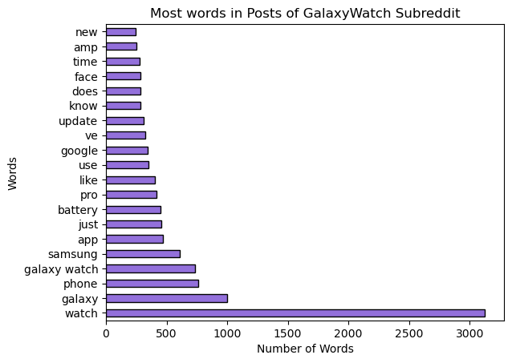
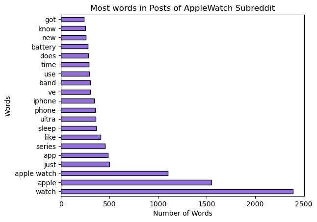
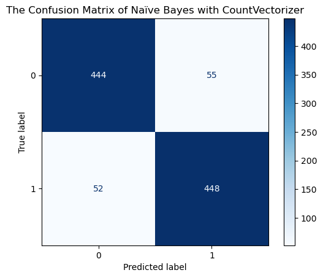
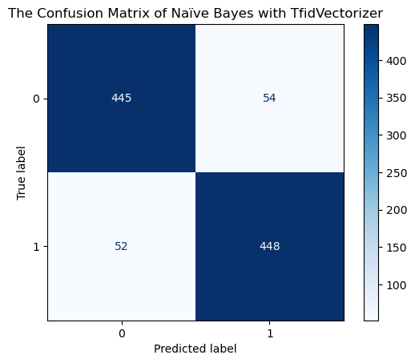
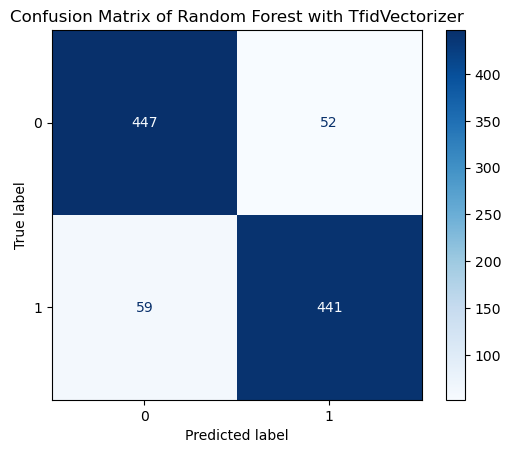
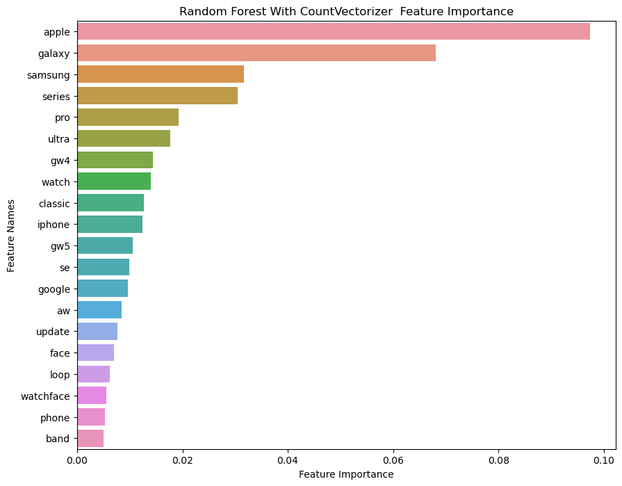
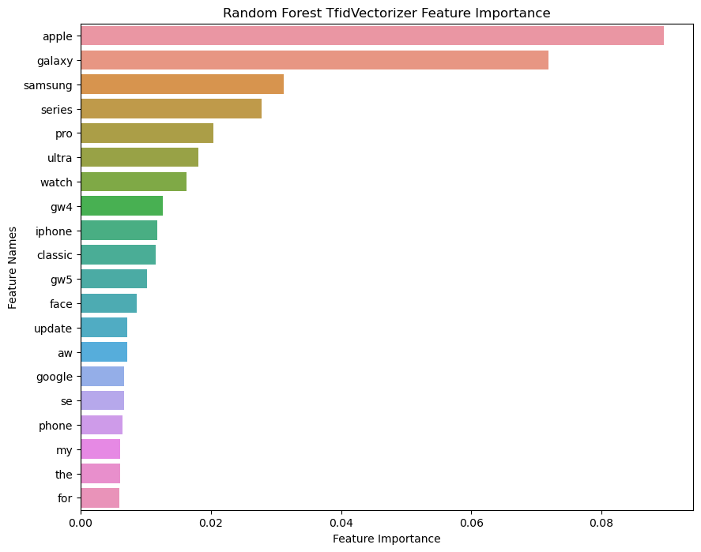

# "Predicting Subreddit Subjects: Exploring the Capabilities of Machine Learning Models"

### Problem Statement

"Despite the abundance of online forums and social media platforms, categorizing user-generated content remains a challenge. However, recent advances in machine learning have enabled the creation of models that can predict the subject of a subreddit based on the data from the subreddit itself. Despite the success of these models, there is a need to explore their limitations, accuracy, and potential applications in various domains. Here in T-Mobile as a data scientist, my focus is on trying diffrenet machine learning algorithms to find the best model for predicting two different subreddits of our devices (Apple Watch and Samsung Galaxy Watch) based on subreddit contents."

### Background

Online forums and social media platforms like Reddit have become valuable sources of information and feedback for businesses and individuals alike. With millions of users sharing their thoughts, opinions, and experiences on a wide range of topics, these platforms provide rich data that can be used to gain insights into customer needs and preferences. However, analyzing this data manually can be time-consuming and inefficient, especially when dealing with large volumes of posts and comments.

In recent years, machine learning algorithms have emerged as powerful tools for analyzing and classifying text data. These algorithms can learn to identify patterns, relationships, and trends in large datasets and make predictions based on those patterns. One area where these algorithms could show great promise is in predicting the subreddit to which a post belongs based on its content.

In this project, we present an approach for collecting and preprocessing the data from Apple Watch and Samsung Galaxy Watch subreddits and using natural language processing techniques to extract features from the text data. We will then train and test machine learning algorithms to determine the most accurate algorithm for predicting the subreddit based on the content of the post.

By leveraging the insights from our analysis, we can gain a better understanding of the language used by users when discussing the Apple Watch and Samsung Galaxy Watch. This information can be used to inform our product development, marketing, and customer service strategies, helping to focus on products that better meet the needs and preferences of your customers.

---

### Datasets

The raw datasets (apple and samsung) are provided from AppleWatch and GalaxyWatch subreddits in www.reddit.com through using Pushshift's API, which were about 3500 rows in 98 columns for each data set.
Each raw dataset were used in EDA part for cleaning and exploring data and the number of columns were reduced to only 5 (feature engineered columns included). The names of final subreddit datasets after cleaning and feature engineering are apple watch and galaxy watch.
Among above datasets, there is a final clean dataset which is the combined of apple watch and galaxy watch datasets. This dataset were used for making models.
The data dictionary contains all features, provided and engineered, that were used for EDA and making models.
In the following you could find datasets:

* [`apple.csv`](./data/apple.csv)
* [`samsung.csv`](./data/samsung.csv)
* [`apple_watch.csv`](./data/apple_watch.csv)
* [`galaxy_watch.csv`](./data/galaxy_watch.csv)
* [`final.csv`](./data/final.csv)

---

### Data Dictionary

|Feature|Type|Dataset|Description|
|---|---|---|---|
|authur|str|apple/samsung/apple_watch/galaxy_watch/final|author of post|
|description|str|apple_watch/galaxy_watch/final|including title and description of post|
|num_comments|int|apple/samsung/apple_watch/galaxy_watch/final| shows the number of comments that post got|

---

### Data Cleaning and Exploratory Data Analysis (EDA)

In this part I mostly tried to first make my final datasets for making models and also doing some exploratory analysis to see if I find some valuable results for marketing and sales departments.

#### Cleaning and preprocessing

> 1. For modeling, most valuable columns are descriptive columns which are in our project title and self tesxt, however, there were so many null values in self text, so I made another column "description" which is the combined column of title and self text.
> 2. After checking data sets, finaly made a final ones for exploring and modeling which only include author, description, number of comments, subreddit name and description.

#### Explratory Data Analysis

> 1. Made a histogram of description word count to see the type of distribution and beside that, found that most of the descriptions in both galaxywatch and applewatch posts subreddits are less than 250 words.
> 2. Made a histogram of number of comments for and found there were not much comments in any of them.
> 3. Tried to find a relationship between lenght of description and number of comments, but after all, couldn't find a clear relationship.
> 4. Filtered on users (author) with most number of description and it seemed that most of the descriptions are overaly positive in glaxywatch and in applewatch, the author with most number of description, talks more about type of applewatch bands.
> 5. Instansiated Countvectorizer and fitted and transformed feuture (description column) and then made a dataframes out of that. Then sorted dataframes based on the most repeated words in those dataframes, here you could find a plot of those words.

---

### Models
In this part I made models with Naïve Bayes and Random Forest algorithms with CountVectorizer and TfidVectorizer transformers to predict my target (subreddit sunject). Also, used pipeline and GridSearch techniques for finding the best params and best scores and finaly plotted confusion matrix for evaluating models and plotted best feature importances to see which features(words) played the major role to build the models.

#### Naïve Bayes

> 1. First I made a combined dataframe of applewatch and galaxywatch.
> 2. Then labaled our target (subreddit) by mapping galaxywatch to 1 and applewatch to 0.
> 3. Made a function for stemming words during making model.
> 4. Trained and splitted data.
> 6. The baseline accuracy is %50.
> 5. For modelling, I used Pipeline to have MultinomialNB Naïve Bayes algorithm and CountVectorizer transformer with setting a range of params for GreadSearch over them. Did the same process one more time with TfidVectorizer Transformer.
> 6. In the following the details of evaluation scores and also confusion matrix are visualized.

|Model|Transformer|Metric|Metric Score|Interpretation|
|---|---|---|---|---|
|Naïve Bayes|CountVectorizer|Accuracy|%89|out of all subreddits, we %89 labeled them correctly|
|Naïve Bayes|CountVectorizer|Precision|%89|of those we labeled as galaxywatch, %89 actually are galaxywatch subreddits|
|Naïve Bayes|CountVectorizer|Sensitivity|%89|of all galaxywatch subreddits, %89 of those we predicted as galaxywatch subreddits|
|Naïve Bayes|CountVectorizer|Specifity|%89|of all applewatch subreddits, %89 of those we predicted as applewatch subreddits|
|Naïve Bayes|TfidVectorizer|Accuracy|%89|out of all subreddits, we %89 labeled them correctly|
|Naïve Bayes|TfidVectorizer|Precision|%89|of those we labeled as galaxywatch subreddit, %89 actually are galaxywatch subreddits|
|Naïve Bayes|TfidVectorizer|Sensitivity|%89|of all galaxywatch subreddits, %89 of those we predicted as galaxywatch subreddits|
|Naïve Bayes|TfidVectorizer|Specifity|%89|of all applewatch subreddits, %89 of those we predicted as applewatch subreddits|

#### Random Forest

> 1. First I made a combined dataframe of applewatch and galaxywatch.
> 2. Then labaled our target (subreddit) again by mapping galaxywatch to 1 and applewatch to 0.
> 3. Made a function for stemming words during making model.
> 4. Made another function to make a dataframe based on feuture names and importance scores, sorted by scores and finally plotting the result. 
> 5. Trained and splitted data.
> 6. The baseline accuracy is 50%.
> 7. For modelling, I used Pipeline to have Random Forest algorithm and CountVectorizer transformer with setting a range of params for GreadSearch over them. Then, did the same process one more time with CountVectorizer Transformer.
> 8. In the following the details of evaluation scores and also confusion matrix are visualized.
> 9. Used function that was made for plotting the feature importances based on the values of best params of CountVectorizer and CountVectorizer transformers.

|Model|Transformer|Metric|Metric Score|Interpretation|
|---|---|---|---|---|
|Random Forest|CountVectorizer|Accuracy|%88|out of all subreddits, we %88 labeled them correctly|
|Random Forest|CountVectorizer|Precision|%90|of those we labeled as galaxywatch subreddits, %90 actually are galaxywatch subreddits|
|Random Forest|CountVectorizer|Sensitivity|%86|of all galaxywatch subreddits, %86 of those we predicted as galaxywatch subreddits|
|Random Forest|CountVectorizer|Specifity|%90|of all applewatch subreddits, %90 of those we predicted as applewatch subreddits|
|Random Forest|TfidVectorizer|Accuracy|%88|out of all subreddits, we %88 labeled them correctly|
|Random Forest|TfidVectorizer|Precision|%89|of those we labeled as galaxywatch subreddit, %89 actually are galaxywatch subreddits|
|Random Forest|TfidVectorizer|Sensitivity|%88|of all galaxywatch subreddits, %88 of those we predicted as galaxywatch subreddits|
Random Forest|TfidVectorizer|Specifity|%89|of all applewatch subreddits, %89 of those we predicted as applewatch subreddits|

---

### Conclusions

* We experimented with two most NLP transformers for collecting words from contents, including CountVectorizer and TfidVectorizer and After evaluating two models with those transformers, we found that the models scores are somehow the same, however I chose the Random Forest Algorithm with TfidVectorizer, achieving an accuracy of %88 on the test set and also I used it's feature importance to find out major features.

* In addition to predicting the subreddit based on the content of the post, we also identified the most common words used by users when discussing the Apple Watch and Samsung Galaxy Watch. Our analysis revealed that the most common words used in the Apple Watch subreddit were "watch", "apple", "app", "series", "sleep", "ultra", "band" and "battery", while the most common words used in the Samsung Galaxy Watch subreddit were "watch", "galaxy", "app", "battery", "pro", "google", "update", and "face".

* Beside those common words in each subreddit, we also found which words in the combined dataset of those subreddits, played a main role in making our model.

---

### Recommendations

* WE could consider to incorporate the most common words used in the Apple Watch and Samsung Galaxy Watch subreddits into our product development and marketing strategies. By understanding the language used by users when discussing these products.

* We should use insights gained from our analysis to inform our customer service strategies. By understanding the most common issues and concerns expressed by users in these subreddits, we can proactively address these concerns and provide better support to our customers.

* The team of data scientists should experiment with different machine learning algorithms and transformer models to further improve the accuracy of subreddit prediction. In my project I used Naïve Bayes and Random Forest models, but there may be other models like  SVM and Extra Trees that perform even better for this task.

* WE better Consider expanding the analysis of other subreddits and social media platforms related to our products and services (like rate plans, connectivity coverage quality and phone devices) to gain a more comprehensive understanding of customer needs and preferences.