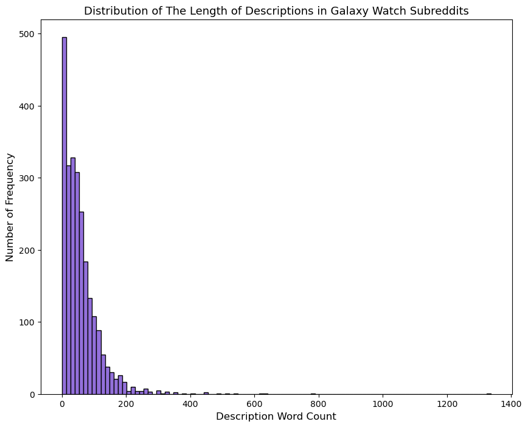
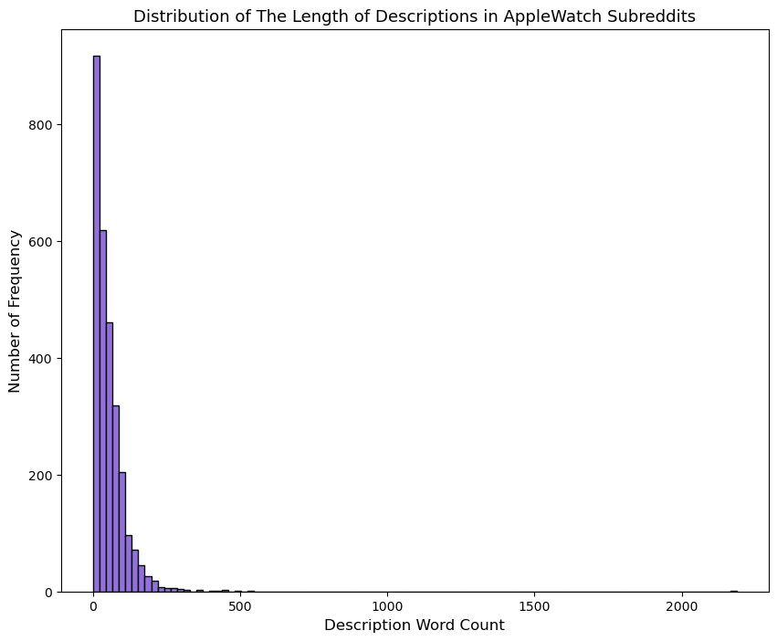
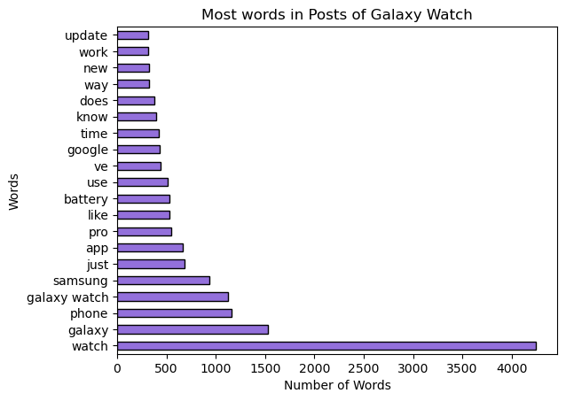
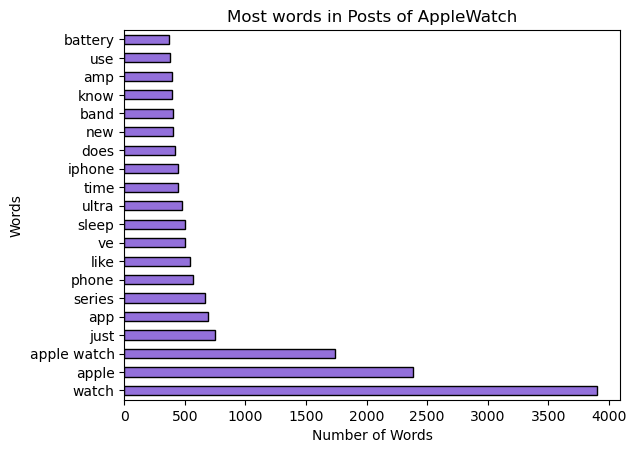
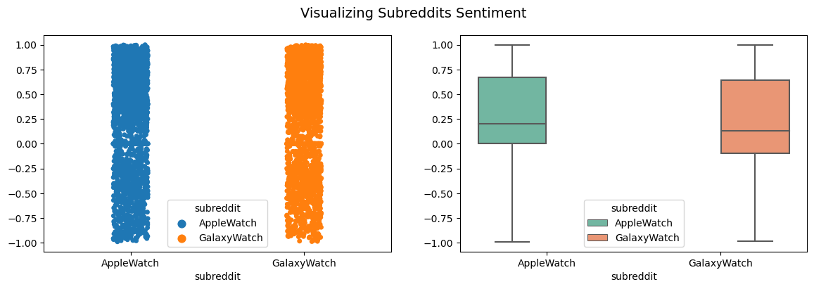
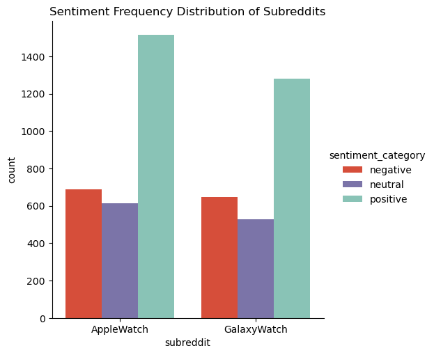
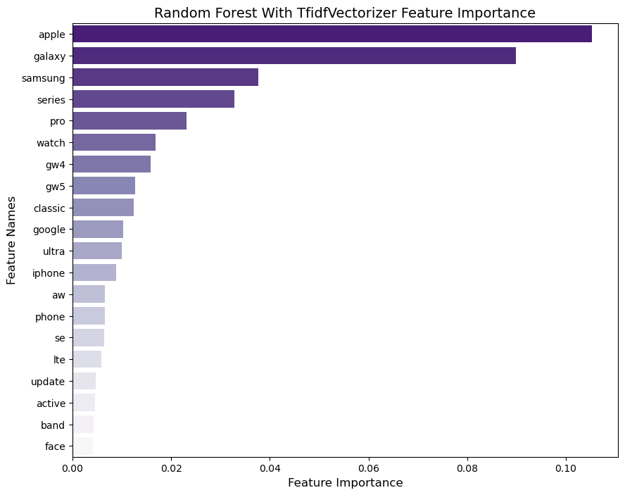
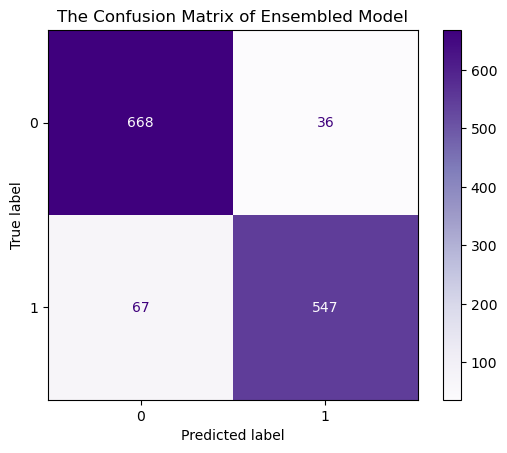

# Predicting Subreddit Subjects: Exploring the Capabilities of Machine Learning Models

### Contents:

- [Problem Statement](#Problem-Statement)
- [Background](#Background)
- [Datasets](#Datasets)
- [Exploratory Data Analysis (EDA), Preprocessing and Sentimental Analysis](#Exploratory-Data-Analysis-(EDA),-Preprocessing-and-Sentimental-Analysis)
    - [Post Length Distribution](#Post-Length-Distribution)
    - [Word Frequency Analysis](#Word-Frequency-Analysis)
    - [Sentimental Analysis](#Sentimental-Analysis)
- [The Ensembled Model](#The-Ensembled-Model)
- [Conclusions](#Conclusions)
- [Recommendations](#Recommendations)

---

### Problem Statement

"Despite the abundance of online forums and social media platforms, categorizing user-generated content remains a challenge. However, recent advances in machine learning have enabled the creation of models that can predict the subject of a subreddit based on the data from the subreddit itself. Despite the success of these models, there is a need to explore their limitations, accuracy, and potential applications in various domains. Here in T-Mobile as a data scientist, my focus is on trying diffrenet machine learning algorithms to find the best model for predicting two different subreddits of our devices (Apple Watch and Samsung Galaxy Watch) based on subreddit contents."

---

### Background

Online forums and social media platforms like Reddit have become valuable sources of information and feedback for businesses and individuals alike. With millions of users sharing their thoughts, opinions, and experiences on a wide range of topics, these platforms provide rich data that can be used to gain insights into customer needs and preferences. However, analyzing this data manually can be time-consuming and inefficient, especially when dealing with large volumes of posts and comments.

In recent years, machine learning algorithms have emerged as powerful tools for analyzing and classifying text data. These algorithms can learn to identify patterns, relationships, and trends in large datasets and make predictions based on those patterns. One area where these algorithms could show great promise is in predicting the subreddit to which a post belongs based on its content.

In this project, we present an approach for collecting and preprocessing the data from Apple Watch and Samsung Galaxy Watch subreddits and using natural language processing techniques to extract features from the text data. We will then train and test machine learning algorithms to determine the most accurate algorithm for predicting the subreddit based on the content of the post.

By leveraging the insights from our analysis, we can gain a better understanding of the language used by users when discussing the Apple Watch and Samsung Galaxy Watch. This information can be used to inform our product development, marketing, and customer service strategies, helping to focus on products that better meet the needs and preferences of your customers.

---

### Datasets

The project involved two raw datasets obtained from the AppleWatch and Galaxy Watch subreddits on www.reddit.com using Pushshift's API. Each dataset contained approximately 3,500 rows and 98 columns. During the exploratory data analysis (EDA) phase, the datasets underwent cleaning and data exploration. The number of columns was reduced to 5, including feature-engineered columns. The final clean dataset was created by combining the cleaned datasets for further analysis and model development.

* [`apple.csv`](./data/apple.csv)
* [`samsung.csv`](./data/samsung.csv)
* [`apple_watch.csv`](./data/apple_watch.csv)
* [`galaxy_watch.csv`](./data/galaxy_watch.csv)
* [`final_dataset.csv`](./data/final_dataset.csv)

|Feature|Type|Dataset|Description|
|---|---|---|---|
|authur|str|apple/samsung/final_dataset|author of the post|
|title|str|apple/samsung|title of each post|
|selftext|str|apple/samsung|description of each post|
|description|str|apple/samsung/final_dataset|including title and description (selftext) of each post|
|des_word_count|int|final_dataset| shows the number of words in each post|

---

### Exploratory Data Analysis (EDA), Preprocessing and Sentimental Analysis

Performing exploratory data analysis (EDA) and preprocessing on the collected data from the AppleWatch and Galaxy Watch subreddits is a crucial step for gaining insights, understanding the data, and preparing it for further analysis and modeling.

In the preprocessing stage, we addressed data quality and consistency issues. This includes handling missing values, cleaning and standardizing the text data, and addressing duplicates or irrelevant content. We also performed feature engineering to extract meaningful features from the text data that can improve the predictive power of our models.

The Following steps were taken in this part:

> **Missing Values Handling and Feature Engineering:**
>
> **Drop Unuseful Columns**
>
> **Handling Duplicates**
>
> **Text Data Preprocessing**
>
> **Post Length Distribution**
>
> **Word Frequency Analysis**
>
> **Sentimental Analysis**

### Post Length Distribution

The post length distribution for AppleWatch and Galaxy Watch subreddits provides insights into the length of posts submitted by users. It helps identify common post lengths and understand user engagement patterns. This information can be used to optimize content strategies, tailor responses to post length, and improve user interaction. Analyzing the distribution helps identify trends and preferences within each subreddit, guiding communication and content creation strategies.

Below, we could see the distribution of posts in mentioned subreddits:

&nbsp; &nbsp; &nbsp; &nbsp;

**Above Plots show us that most of the descriptions for AppleWatches and Galaxy Watches are less that 100 word**

### Word Frequency Analysis

Word frequency analysis involves counting the occurrence of words in a text or dataset. It helps identify the most frequently used words and their frequencies. This analysis is used to gain insights into the main themes, topics, and trends present in the data. It aids in understanding the language patterns, identifying key terms, and extracting meaningful information. Word frequency analysis is valuable for various applications, such as content analysis, sentiment analysis, topic modeling, and keyword optimization for SEO. It enables researchers and analysts to uncover patterns and make data-driven decisions based on the prominence of specific words in the dataset.

**Above plot shows us besides expected words like "watch", "galaxy", "phone", "google" and "samsung", other frequent words such as "app", "battery", "update" and "pro" are common topics of discussion within the Galaxy Watch subreddit community.**

**Above plot shows us besides expected words like "watch", "apple", "applewatch" and "phone", other frequent words such as "app", "serries", "sleep", "ultra" and "band" and "battery" are common topics of discussion within the AppleWatch subreddit community.**

### Sentimental Analysis

In our project, sentiment analysis using VADER can help us gauge the sentiment of the posts made by users. By analyzing the sentiment, we can understand the overall opinion or emotional tone of the discussions within the subreddit. This information can be valuable for predicting trends, identifying user satisfaction or dissatisfaction, or understanding user preferences regarding Apple Watch and Galaxy Watch products.

The compound score, generated by the VADER sentiment analyzer, represents the overall sentiment polarity of a given text. It takes into account the individual sentiment scores of the text's words and combines them to provide an overall sentiment score.

The compound score ranges between -1 and 1, where:

> **Scores above 0 indicate a positive sentiment**
>
> **Scores below 0 indicate a negative sentiment**
>
> **Scores around 0 indicate a neutral sentiment**

The magnitude of the compound score represents the intensity of the sentiment. The closer the score is to -1 or 1, the stronger the sentiment expressed in the text.

**The plots indicate that AppleWatch posts have a more positive sentiment compared to Galaxy Watch posts.**

**The plots demonstrate a higher number of positive sentiments in Apple Watch posts compared to Galaxy Watch posts. However, it is important to note that the overall number of Apple Watch subreddits is greater than that of Galaxy Watch after preprocessing.**

---

### Machine Learning Models

In this project, we conducted experiments using various machine learning models, including Logistic Regression, Naïve Bayes, Bagged Decision Tree, Random Forest, Extra Trees, Ada Boost, Gradient Boost, XGBoost, and SVM. We applied the CountVectorizer and TfidfVectorizer transformers to preprocess the data with different hyperparameters. Following evaluation, we determined the optimal parameters for each model in combination with the most effective transformer. The resulting accuracy scores are presented in the table below, showcasing the performance of each model.

|Model|Transformer|Accuracy Score|
|---|---|---|
|Logistic Regression|TfidfVectorizer|0.8945|
|Naïve Bayes|CountVectorizer|0.9067|
|Bagged Decision Tree|CountVectorizer|0.8763|
|Random Forest|TfidfVectorizer|0.8961|
|Extra Trees|TfidfVectorizer|0.8945|
|Ada Boost|TfidfVectorizer|0.8937|
|Gradient Boost|CountVectorizer|0.8983|
|XGBoost|CountVectorizer|0.8930|
|SVM|TfidfVectorizer|0.9014|

#### Feature Importances with Extra Trees

Feature importances in Extra Trees represent the relative significance of each feature in predicting the target variable. They measure how much each feature reduces impurity during model construction. Analyzing feature importances helps identify influential factors and understand the relationships between features and the target. This information is valuable for feature selection, identifying key drivers, and gaining insights into the factors that impact model predictions. It aids in understanding the most important variables and their contributions to the overall predictive power of the model.

**The above plot shows that key features such as watch names, brands, series, and specific features like health have significant importance in predicting the subreddit classes for AppleWatch and Galaxy Watch.**

---

### The Ensembled Model

For ensemble modeling using the Voting Classifier, we followed two approaches. First, we ensembled all the models (except Bagged Decision Tree and AdaBoost) we have trained so far, regardless of their category. This approach combines the predictions of all models to make the final prediction. Alternatively, created a second ensemble model using only the selected best models from each category.

Based on the accuracy scores obtained, it appears that the Extra Trees model performed the best among the decision tree models, while Gradient Boost performed the best among the boosting models. Therefore, for the second ensemble model, we focused on using the following models: **Logistic Regression**, **Naïve Bayes**, **Extra Trees**, **Gradient Boost**, and **SVM**.

By evaluating the accuracy scores, we conclude that the Ensembled Model using the selected best models achieved a higher accuracy score of 0.9219, outperforming the model that included all models with an accuracy score of 0.9181.

|Model|Accuracy Score|
|---|---|
|Baseline|0.5341|
|Logistic Regression|0.8945|
|Naïve Bayes|0.9067|
|Random Forest|0.8961|
|Extra Trees|0.8945|
|Gradient Boost|0.8983|
|SVM|0.9014|
|Ensembled (Voting Classifier)|0.9219|

**The Confusion Matrix:**

The confusion matrix for the ensembled model provides a summary of the model's prediction accuracy and errors. It visualizes the number of correct and incorrect predictions for each class, enabling an assessment of the model's performance across different categories. Analyzing the confusion matrix helps identify patterns, evaluate classification accuracy, and guide improvements in the model's predictive capabilities.

|Metric|Score|
|---|---|
|Accuracy|0.9219|
|Precision|0.9383|
|Sensitivity|0.8909|
|Specifity|0.9489|
|F1|0.9140|

---

### Conclusions

* Collected raw datasets from AppleWatch and GalaxyWatch subreddits using the Pushshift API.

* Conducted word frequency analysis to identify common words and themes in the posts.

* Analyzed sentiment of the posts, revealing a more positive sentiment in Apple Watch posts compared to Galaxy Watch posts.
Trained multiple classification models including Logistic Regression, Naïve Bayes, Random Forest, Extra Trees, Gradient Boost, XGBoost, and SVM.

* Created an ensembled model using selected best models (Extra Trees, Gradient Boost, Logistic Regression, Naïve Bayes, and SVM) to improve subreddit prediction, achieved an accuracy of 0.9219.

---

### Recommendations

* WE could consider to incorporate the most common words used in the AppleWatch and Galaxy Watch subreddits into our product development and marketing strategies. By understanding the language used by users when discussing these products.

* We should use insights gained from our analysis to inform our customer service strategies. By understanding the most common issues and concerns expressed by users in these subreddits, we can proactively address these concerns and provide better support to our customers.

* WE better Consider expanding the analysis of other subreddits and social media platforms related to our products and services (like rate plans, connectivity coverage quality and phone devices) to gain a more comprehensive understanding of customer needs and preferences.